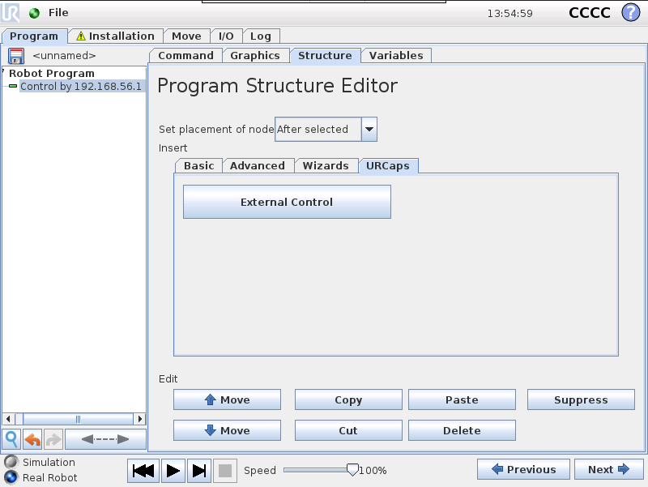

# Ursim docker

This repo hosts Dockerfiles for the ursimulator. These dockerfiles are hosted as
images on Docker Hub. These images are taged with the official release of the ursimulator
that the dockerfile builds.

The container sets up a VNC server and exposes a port in which you can access the
robots GUI to control the robot. It also exposes all other available interfaces
in which you can control the robot remotely.

There are two different versions of the simulator an e-series robot and a CB3
robot. There is an image for both CB3 and e-series.

You can find the image on [Docker Hub](https://hub.docker.com/repository/docker/mahp2502/ursim_docker/general)
(currently not public).

**Disclaimer** The docker image is primarily created to be used inside test pipelines
on GitHub. It can also be used as an alternative to the virtual machine solution
however there is no guaranties that the docker image will work as expected.

## How to use this image

First you should go ahead and pull the docker image of the version you want to use.
For that the following command can be used (image is currently not public).

```bash
docker pull mahp2502/ursim_docker:tagname
```

You can also build the image with the following command:

```bash
docker build ursim/e-series -t myursim --build-arg VERSION=5.11.1.108318 --build-arg URSIM="https://s3-eu-west-1.amazonaws.com/ur-support-site/118926/URSim_Linux-5.11.1.108318.tar.gz"
```

When the image has been pulled/build you can go ahead and run the image with the
following command.

```bash
docker run --rm -it -p 5900:5900 -p 29999:29999 -p 30001-30004:30001-30004 myursim
```

Now you can use a VNC application to view the robots GUI, by connecting to localhost:5900.
And you will have a fully functional simulator which can be used inside applications
or testing pipelines.

This is just a quick example on how to get you started.

## Parameters

You can use the container with the different parameters, all parameters available
can be seen below.

| Parameter                | Description |
| ---                      | ---                                                                                                                            |
| `-e ROBOT_MODEL=UR5`     | Specify robot model to simulate. Valid options are UR3, UR5 and UR10. Defaults to UR5.                                         |
| `-e TZ=Europe/Copenhagen`| Specify a timezone to use. Defaults to Europe/Copenhagen.                                                                      |
| `-p 5900`                | Allows VNC access to the robots interface.                                                                                     |
| `-p 502`                 | Allows access to Universal Robots Modbus port.                                                                                 |
| `-p 29999`               | Allows access to Universal Robots dashboard server interface port.                                                             |
| `-p 30001`               | Allows access to Universal Robots primary interface port.                                                                      |
| `-p 30002`               | Allows access to Universal Robots secondary interface port.                                                                    |
| `-p 30003`               | Allows access to Universal Robots real-time interface port.                                                                    |
| `-p 30004`               | Allows access to Universal Robots RTDE interface port.                                                                         |

## Programs

The `/ursim/programs` is used for storing robot programs created when using the
simulator. If one wishes to persist these files beyond the lifecycle of the container,
the `/ursim/programs` can be mounted to an external volume on the host.

For example, if one wants to save the programs in a `~/programs` folder we
can simply launch the container with an additional volume argument:

```bash
docker run --rm -it -p 5900:5900 -v "${HOME}/programs:/ursim/programs" myursim
```

## URCaps

It is possible to use this simulator together with URCaps. For using this simulator
with URCaps, you can follow the [e-series](#e-series-URCaps-installation) instructions
or the [CB3](#CB3-URCaps-installation) instruction.

### e-series URCaps installation

This example will show how to install the **externalcontrol-1.0.5.urcap** in the
e-series simulator, the same guide can be used to install any other URCap in the
simulator.

First you will have to create a volume for storing polyscope changes:

```bash
docker volume create ursim-gui-cache
```

We also need a volume for storing the URCaps build:

```bash
docker volume create urcap-build-cache
```

Now we need to copy the URCap to the `/ursim/programs` folder, this can be done
by mounting the folder to an external volume on the host as explained in the [programs
section](#programs) and then copy the URCap to that folder.

Now we can start the simulator.

```bash
docker run --rm -it --mount source=ursim-gui-cache,target=/ursim/GUI --mount source=urcap-build-cache,target=/ursim/.urcaps -p 5900:5900 -v "${HOME}/programs:/ursim/programs" myursim_eseries
```

Now use a VNC application to view the robots GUI, by connecting to localhost:5900.

On the welcome screen click on the hamburger menu in the top-right corner and select
*Settings* to enter the robot's setup.  There select *System* and then *URCaps*
to enter the URCaps installation screen.

 

There, click the little plus sign at the bottom to open the file selector. There
you should see
all urcap files stored inside the robot's programs folder. Select and open
the **externalcontrol-1.0.5.urcap** file and click *open*. Your URCaps view should
now show the **External Control** in the list of active URCaps and a notification
to restart the robot. Do that
now.

 

When the simulator reeboots the container will stop, and you will have to rerun
the container, with the same command as above.

After the reboot you should be able to find the **External Control** URCaps inside
the *Installation*
section.
For this select *Program Robot* on the welcome screen, select the *Installation*
tab and select
**External Control** from the list.

 

To use the new URCap, create a new program and insert the **External Control** program
node into the program tree


Now you have a fully functional URCap in your simulator.

### CB3 URCaps installation

This example will show how to install the **externalcontrol-1.0.5.urcap** in the
CB3 simulator, the same guide can be used to install any other URCap in the simulator.

First you will have to create a volume for storing polyscope changes:

```bash
docker volume create ursim-gui-cache
```

We also need a volume for storing the URCaps build:

```bash
docker volume create urcap-build-cache
```

Now we need to copy the URCap to the `/ursim/programs` folder, this can be done
by mounting the folder to an external volume on the host as explained in the [programs
section](#programs) and then copy the URCap to that folder.

Now we can start the simulator.

```bash
docker run --rm -it --mount source=ursim-gui-cache,target=/ursim/GUI --mount source=urcap-build-cache,target=/ursim/.urcaps -p 5900:5900 -v "${HOME}/programs:/ursim/programs" myursim_cb3
```

Now use a VNC application to view the robots GUI, by connecting to localhost:5900.

On the welcome screen select *Setup Robot* and then *URCaps* to enter the URCaps
installation
screen.

 

There, click the little plus sign at the bottom to open the file selector. There
you should see
all urcap files stored inside the robot's programs folder. Select and open
the **externalcontrol-1.0.5.urcap** file and click *open*. Your URCaps view should
now show the **External Control** in the list of active URCaps and a notification
to restart the robot. Do that
now.

 

When the simulator reeboots the container will stop, and you will have to rerun
the container, with the same command as above.

After the reboot you should be able to find the **External Control** URCaps inside
the *Installation*
section.
For this select *Program Robot* on the welcome screen, select the *Installation*
tab and select
**External Control** from the list.

 

To use the new URCap, create a new program and insert the **External Control** program
node into the program tree



Now you have a fully functional URCap in your simulator.

## URCaps CI pipelines

For using URCaps inside a CI pipeline a folder `/urcaps` has been created inside
the container. This folder can be mounted to an external folder on the host, storing
the URCaps. **Note It should be the `.jar` file and not the `.urcap` file that
is located inside the folder on the host**.

For example, if one has a folder called `~/urcaps` the container could simply be
launched with the following command:

```bash
docker run --rm -it -p 5900:5900 -v "${HOME}/urcaps:/urcaps" myursim
```

This will install the URCap when running the container and without having to restart
the simulator.
